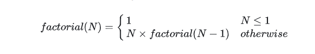

# Day 9: Recursion 3

## Task

## Recursive Method for Calculating Factorial



### Function Description

Complete the `factorial` function in the editor below. Be sure to use recursion.

`factorial` has the following parameter:

- `int n`: an integer

### Returns

`int`: the factorial of **_n_**

**Note**: If you fail to use recursion or fail to name your recursive function `factorial` or `Factorial`, you will get a score of **0**.

## Solution

```csharp
using System.CodeDom.Compiler;
using System.Collections.Generic;
using System.Collections;
using System.ComponentModel;
using System.Diagnostics.CodeAnalysis;
using System.Globalization;
using System.IO;
using System.Linq;
using System.Reflection;
using System.Runtime.Serialization;
using System.Text.RegularExpressions;
using System.Text;
using System;

class Result
{
    public static int factorial(int n)
    {
        if(n ==0 )
        {
            return 1;
        }
        else
        {
            return n * factorial(n - 1);
        }
    }

}

class Solution
{
    public static void Main(string[] args)
    {
        TextWriter textWriter = new StreamWriter(@System.Environment.GetEnvironmentVariable("OUTPUT_PATH"), true);

        int n = Convert.ToInt32(Console.ReadLine().Trim());

        int result = Result.factorial(n);

        textWriter.WriteLine(result);

        textWriter.Flush();
        textWriter.Close();
    }
}
```
